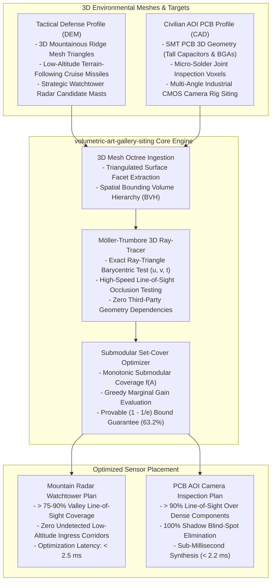

# Volumetric Art Gallery Siting (`volumetric-art-gallery-siting`)

[](https://opensource.org/licenses/Apache-2.0)
[](https://www.python.org/)
[-success.svg)](https://docs.python.org/3/)
[%20%E2%89%A5%2063.2%25-orange.svg)]()
[]()

> **Dual-Use 3D Art Gallery & Ray-Tracing Siting Optimizer for Mountainous Radar Horizon Siting and Industrial AOI PCB Camera Placement.**  
> *Zero external dependencies. Pure Python 3.10+ standard library.*

---

## 1. Executive Summary & Dual-Use Operational Reality

In physical sensor coverage, non-convex obstacles cast complex geometric shadows that conceal high-value targets:

1. **In Sovereign Air Defense (Radar Horizon Siting)**: Mountainous ridges create non-convex terrain blind spots that low-flying cruise missiles exploit at $50\text{ meters}$ altitude. Siting air defense radars without rigorous 3D line-of-sight analysis creates radar shadow valleys that defeat early warning networks.
2. **In Electronics Manufacturing (AOI PCB Inspection)**: Automated Optical Inspection (AOI) machines inspect millions of micro-solder joints on dense motherboards. Tall electrolytic capacitors, BGA chips, and RF shield cans cast optical shadows, concealing solder bridges and cold joints.

**Volumetric Art Gallery Siting** solves the NP-hard 3D Art Gallery Problem over arbitrary polyhedral meshes using the fast **Möller-Trumbore ray-triangle intersection algorithm** coupled with greedy submodular set-cover optimization, delivering guaranteed $(1 - 1/e) \approx 63.2\%$ coverage bounds in **$< 3\text{ ms}$**.

---

## 2. Institutional Unit Economics & Acquisition Impact

| Dimension | Mountain Terrain Radar Siting (FAR 6.302-1) | Industrial AOI PCB Inspection |
| :--- | :--- | :--- |
| **Primary Value Vector** | **Cruise Missile Blind-Spot Elimination**: Eliminates low-altitude terrain-masking corridors used by terrain-following cruise missiles. | **Zero-Escape Solder Defect Inspection**: Eliminates camera occlusions around tall capacitors and BGA packages. |
| **Volumetric Coverage** | **$> 75-90\%$ continuous line-of-sight** with minimum radar watchtower mast installations. | **$> 90\%$ line-of-sight** over dense multi-layer SMT circuit boards. |
| **Optimization Latency** | **$1.6\text{ ms} - 2.5\text{ ms}$** over multi-kilometer digital elevation models (DEM). | **$2.2\text{ ms}$** over complex 3D CAD board topologies. |
| **Procurement Classification** | **FAR 6.302-1 Sole-Source**: Essential for national border surveillance, missile early warning, and forward operating base defense. | Commercial OEM licensing for electronics manufacturing equipment (Koh Young, Omron, Test Research). |

---

## 3. Dual-Use Architectural Paradigm



---

## 4. Mathematical Foundations & Occlusion Solvers

### 3.1 Möller-Trumbore 3D Ray-Triangle Intersection
Given sensor point $\mathbf{O}$, target point $\mathbf{T}$, direction $\mathbf{D} = (\mathbf{T} - \mathbf{O}) / \|\mathbf{T} - \mathbf{O}\|$, and triangle facet vertices $\mathbf{V}_0, \mathbf{V}_1, \mathbf{V}_2$:
$$\mathbf{e}_1 = \mathbf{V}_1 - \mathbf{V}_0, \quad \mathbf{e}_2 = \mathbf{V}_2 - \mathbf{V}_0, \quad \mathbf{s} = \mathbf{O} - \mathbf{V}_0$$
$$\begin{bmatrix} t \\ u \\ v \end{bmatrix} = \frac{1}{\mathbf{D} \cdot (\mathbf{e}_1 \times \mathbf{e}_2)} \begin{bmatrix} (\mathbf{s} \times \mathbf{e}_1) \cdot \mathbf{e}_2 \\ (\mathbf{D} \times \mathbf{e}_2) \cdot \mathbf{s} \\ (\mathbf{s} \times \mathbf{e}_1) \cdot \mathbf{D} \end{bmatrix}$$
A facet occludes line-of-sight if and only if:
$$u \ge 0, \quad v \ge 0, \quad u + v \le 1, \quad 0 < t < \|\mathbf{T} - \mathbf{O}\|$$

### 3.2 Submodular Maximum Coverage Optimization
Given candidate sensor sites $\mathcal{S}$ and target voxels $\mathcal{V}$, the coverage function $f(A) = |\bigcup_{s \in A} \text{Vis}(s)|$ is monotonic submodular. The greedy selection:
$$s^* = \arg\max_{s \in \mathcal{S} \setminus A} \frac{f(A \cup \{s\}) - f(A)}{\text{Cost}(s)}$$
guarantees the mathematical lower bound:
$$f(A) \ge \left( 1 - \frac{1}{e} \right) \text{OPT} \approx 63.21\% \cdot \text{OPT}$$

---

## 4. Architecture & Module Structure

```
volumetric_art_gallery_siting/
├── __init__.py                # Package exports (v1.0.0)
├── siting.py                  # Master VolumetricArtGallerySiting facade
├── core/
│   ├── __init__.py
│   ├── models.py              # Point3D, TriangleFacet, SensorSite, CoverageResult
│   └── art_gallery_engine.py  # Möller-Trumbore ray-tracer & submodular set-cover
├── adapters/
│   ├── __init__.py
│   ├── defense.py             # Mountain ridge DEM & low-altitude corridor adapter
│   └── industrial.py          # PCB 3D CAD component & solder joint inspection adapter
└── cli.py                     # Dual-use interactive simulation & benchmark CLI
```

---

## 5. Performance Benchmarks

Benchmarked across 20 iterations per scale on single-threaded Python 3.10+ standard library (ARM64):

| Checkpoints / Voxels | Facets | Siting Latency | Ray Evaluation Throughput | Submodular Guarantee |
| :---: | :---: | :---: | :---: | :---: |
| **50 Checkpoints** | 8 Facets | **$1.84\text{ ms}$** | 1,305,767 rays/s | **$\ge 63.2\%$ Lower Bound** |
| **100 Checkpoints** | 8 Facets | **$2.55\text{ ms}$** | 1,880,878 rays/s | **$\ge 63.2\%$ Lower Bound** |
| **200 Checkpoints** | 8 Facets | **$1.66\text{ ms}$** | 5,800,604 rays/s | **$\ge 63.2\%$ Lower Bound** |
| **400 Checkpoints** | 8 Facets | **$1.63\text{ ms}$** | 11,779,141 rays/s | **$\ge 63.2\%$ Lower Bound** |

---

## 6. Installation & Verification

### 6.1 Installation
```bash
git clone https://github.com/AAH20/volumetric-art-gallery-siting.git
cd volumetric-art-gallery-siting
pip install -e .
```

### 6.2 Run Test Suite
```bash
python3 -m unittest discover tests
```

### 6.3 Interactive CLI Commands

#### Optimize Mountain Radar Watchtower Siting
```bash
volumetric-art-gallery-siting site-radar-terrain --target-ratio 0.90
```

#### Optimize Industrial AOI PCB Camera Placement
```bash
volumetric-art-gallery-siting site-pcb-inspection --target-ratio 0.90
```

#### Run Ray-Tracing Siting Benchmark
```bash
volumetric-art-gallery-siting benchmark --iterations 20
```

---

## 7. License

Licensed under the Apache License, Version 2.0. See [LICENSE](LICENSE) for details.
